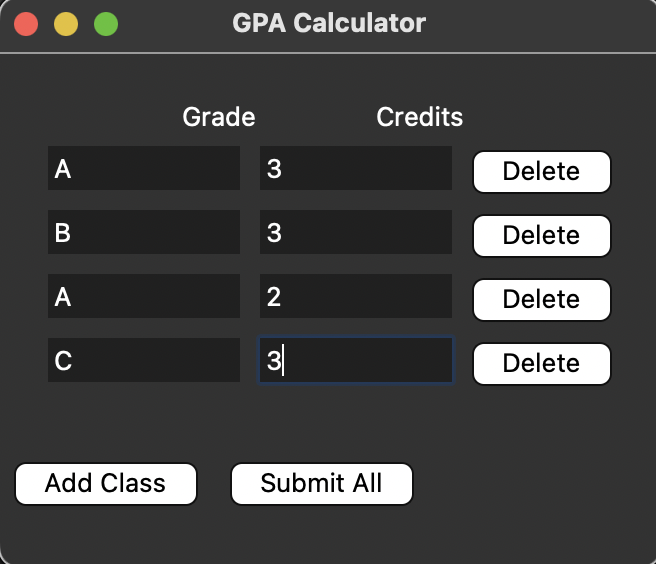

# GPA_Calculator

---

## Description

This GPA Calculator lets you enter your classes, letter grades, and credit hours in a simple window.  
You can add new classes, delete any row, and instantly see your GPA and equivalent letter grade.  
All calculations are done using a clear object-oriented structure, making the code easy to read and modify.

## Features

- **Dynamic Entry:** Add or delete any number of class rows.
- **Input Validation:** Checks for valid letter grades and numeric, positive credits.
- **Instant Feedback:** Errors and results are shown in pop-up dialogs.
- **OOP Backend:** Clean separation of business logic and GUI, making it easy to extend or reuse.
- **Customizable Grading Scale:** Easily modify the grade-to-points conversion.

---

## How It Works

1. **Enter** your letter grades and credits for each class.
2. **Add more classes** with the "Add Class" button, or remove any with the "Delete" button.
3. **Click "Submit All"** to calculate your GPA and see your result (including letter equivalent).

---

## Example Screenshot

## Acknowledgements

Created by Drew Eichhorn.  
If you find this useful or have suggestions, feel free to open an issue or a pull request!
